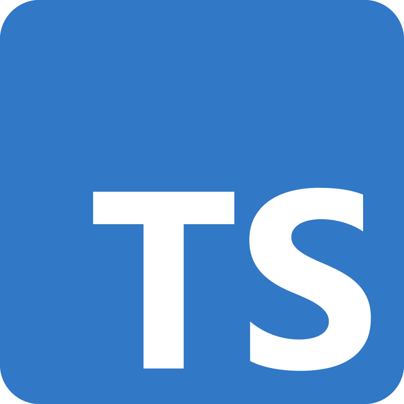

<h1>Pierre Techer Github 👋</h1>

<h2>About me</h2>

    I am a young computer science student passionate about 
    software creation, 
    web development and more generally 
    programming. Currently, I work with languages such as 
    Go, 
    JavaScript/TypeScript, and 
    Python. I am also learning 
    C to further enhance my skills. My goal is ambitious: to design and build an operating system for PC, using C or Rust as the primary languages.

<h2>The technologies I use</h2>

<table>
    <tr>
        <td>
            <table>
                <tr>
                    <td>
                        
                    </td>
                    <td>
                        
JavaScript

                    </td>
                </tr>
            </table>
        </td>
        <td>
            <table>
                <tr>
                    <td>
                        
                    </td>
                    <td>
                        
TypeScript

                    </td>
                </tr>
            </table>
        </td>
        <td>
            <table>
                <tr>
                    <td>
                        
                    </td>
                    <td>
                        
Golang

                    </td>
                </tr>
            </table>
        </td>
    </tr>
    <tr>
        <td>
            <table>
                <tr>
                    <td>
                        
                    </td>
                    <td>
                        
Node.js

                    </td>
                </tr>
            </table>
        </td>
        <td>
            <table>
                <tr>
                    <td>
                        
                    </td>
                    <td>
                        
Nest.js

                    </td>
                </tr>
            </table>
        </td>
        <td>
            <table>
                <tr>
                    <td>
                        
                    </td>
                    <td>
                        
React.js

                    </td>
                </tr>
            </table>
        </td>
    </tr>
    <tr>
        <td>
            <table>
                <tr>
                    <td>
                        
                    </td>
                    <td>
                        
Next.js

                    </td>
                </tr>
            </table>
        </td>
    </tr>
</table>

<!--
**techerpierre/techerpierre** is a ✨ _special_ ✨ repository because its `README.md` (this file) appears on your GitHub profile.

Here are some ideas to get you started:

- 🔭 I’m currently working on ...
- 🌱 I’m currently learning ...
- 👯 I’m looking to collaborate on ...
- 🤔 I’m looking for help with ...
- 💬 Ask me about ...
- 📫 How to reach me: ...
- 😄 Pronouns: ...
- ⚡ Fun fact: ...
-->
